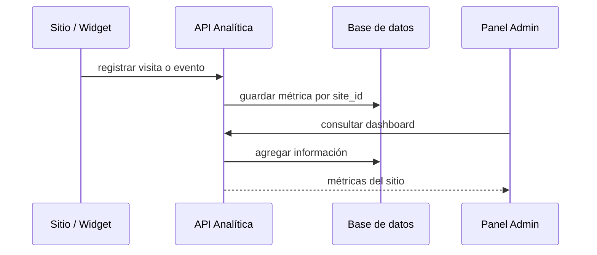

# API del módulo Analítica

El módulo Analítica registra información sobre visitas, eventos y métricas de los sitios. Su objetivo es ofrecer datos que permitan conocer la actividad de los visitantes y apoyar decisiones del administrador.

## Funciones principales

| Función | Descripción |
|---|---|
| Registrar visita | Guarda URL, título, IP, user-agent, referer y sesión. |
| Registrar evento | Guarda interacciones como clics, acciones o eventos definidos. |
| Dashboard | Devuelve métricas agregadas para análisis del sitio. |

## Rutas principales

| Método | Ruta conceptual | Uso |
|---|---|---|
| POST | `/api/modules/analitica/{site_id}/visitas` | Registrar una visita. |
| POST | `/api/modules/analitica/{site_id}/eventos` | Registrar un evento. |
| GET | `/api/modules/analitica/{site_id}/dashboard` | Obtener métricas resumidas. |

## Datos registrados

| Entidad | Campos representativos |
|---|---|
| Visita | URL, título, IP, user-agent, referer, session_id, país, navegador, dispositivo. |
| Evento | Tipo, etiqueta, valor, metadata, URL, session_id. |
| Sesión | Inicio, fin, páginas vistas y duración. |

## Flujo conceptual

## Consideraciones de seguridad

El registro de visitas puede ser público porque ocurre desde el sitio publicado. En cambio, la consulta de dashboard y el registro de ciertos eventos administrativos deben protegerse mediante permisos, especialmente si muestran información interna del sitio.

## Valor dentro del proyecto

Analítica aporta una dimensión de medición al producto. Para una PYME, no basta con publicar una página; también es útil conocer si los usuarios visitan, interactúan o generan eventos relevantes.

**Frase para exposición:** “Analítica convierte al backend en una fuente de métricas por sitio, manteniendo la relación multitenant mediante `site_id`.”

