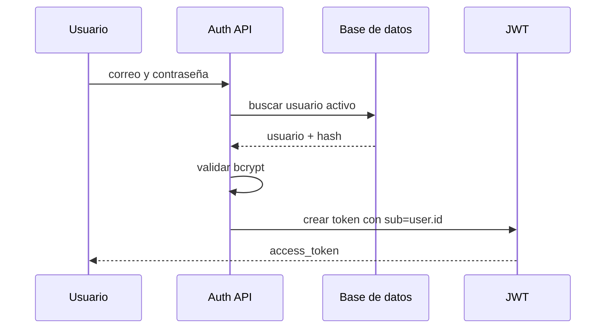

# API de autenticación interna

La autenticación interna permite que usuarios administrativos ingresen al sistema y realicen operaciones protegidas. El backend utiliza JWT como mecanismo principal de sesión y bcrypt para validar contraseñas cifradas.

## Endpoints principales

| Método | Ruta | Descripción |
|---|---|---|
| POST | `/api/auth/registro` | Registra un usuario interno. |
| POST | `/api/auth/inicio` | Inicia sesión y genera token JWT. |
| GET | `/api/auth/me` | Obtiene el perfil del usuario autenticado. |
| PUT | `/api/auth/me` | Actualiza información del perfil. |

## Flujo de login



## Controles aplicados

| Control | Descripción |
|---|---|
| Hash de contraseña | La contraseña no se almacena en texto plano. |
| JWT | El token permite identificar al usuario en rutas protegidas. |
| Usuario activo | Los usuarios inactivos o eliminados lógicamente no deben iniciar sesión. |
| Auditoría | Operaciones como registro o actualización pueden generar trazabilidad. |
| Exclusión de contraseña | La auditoría evita registrar el valor sensible de contraseña. |

## Uso del token

Las rutas protegidas deben enviar el token como Bearer Token:

```http
Authorization: Bearer <access_token>
```

FastAPI valida el token mediante dependencias. Si el token no existe, está vencido, fue manipulado o corresponde a un usuario inactivo, la API debe responder con error de autorización.

## Importancia técnica

La autenticación es un componente crítico porque protege el panel administrativo. Si falla, puede comprometer sitios, plantillas, módulos, productos, publicaciones, roles y configuración del sistema.

## Evidencias sugeridas

- Swagger con endpoints de autenticación;
- pruebas de login correcto e incorrecto;
- pruebas de rutas protegidas sin token;
- código de generación y validación JWT;
- evidencias de hashing bcrypt;
- registros de auditoría generados por operaciones sensibles.

<div class="decision-box" markdown>
**Idea clave:** la autenticación interna combina identidad del usuario, token JWT y estado activo de la cuenta para proteger operaciones administrativas.
</div>
