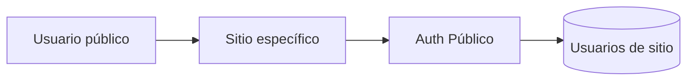

# API de Auth Público

Auth Público permite que usuarios externos se registren e inicien sesión en un sitio generado por All-InOne. Esta autenticación es diferente a la autenticación administrativa interna, porque está orientada al visitante o cliente final de una PYME.

## Diferencia entre usuarios internos y públicos

| Tipo de usuario | Uso |
|---|---|
| Usuario interno | Administra plataforma, sitios, módulos, productos, roles o contenido. |
| Usuario público | Interactúa con un sitio específico como visitante registrado. |

Esta separación es importante porque un usuario público no debería acceder al panel administrativo ni a operaciones internas del sistema.

## Funciones principales

| Operación | Descripción |
|---|---|
| Registro | Crear cuenta de usuario final asociada a un sitio. |
| Login | Iniciar sesión como usuario público. |
| Logout | Cerrar sesión o invalidar contexto del usuario. |
| Perfil | Consultar o actualizar datos del usuario público. |
| Verificación | Validar estado o sesión del usuario. |
| Listado administrativo | Consultar usuarios públicos desde el panel, si existe permiso. |

## Relación con multitenancy

El usuario público debe estar asociado a un sitio. Esto evita que un registro hecho para un tenant sea tratado automáticamente como usuario global de todos los sitios.

## Controles esperados

- separar usuario público de usuario administrativo;
- asociar cada cuenta al sitio correcto;
- proteger datos personales;
- evitar acceso cruzado entre sitios;
- validar credenciales de forma segura;
- registrar acciones relevantes cuando corresponda.

## Importancia en el producto

Auth Público habilita escenarios donde un sitio necesita usuarios finales: compras, historial, interacciones, comentarios o experiencias personalizadas. Aunque no todos los sitios requieran esta función, es un módulo clave para evolucionar All-InOne hacia una plataforma más completa.

**Idea clave:** Auth Público amplía All-InOne hacia usuarios finales por sitio, manteniendo separación frente a los administradores internos.

