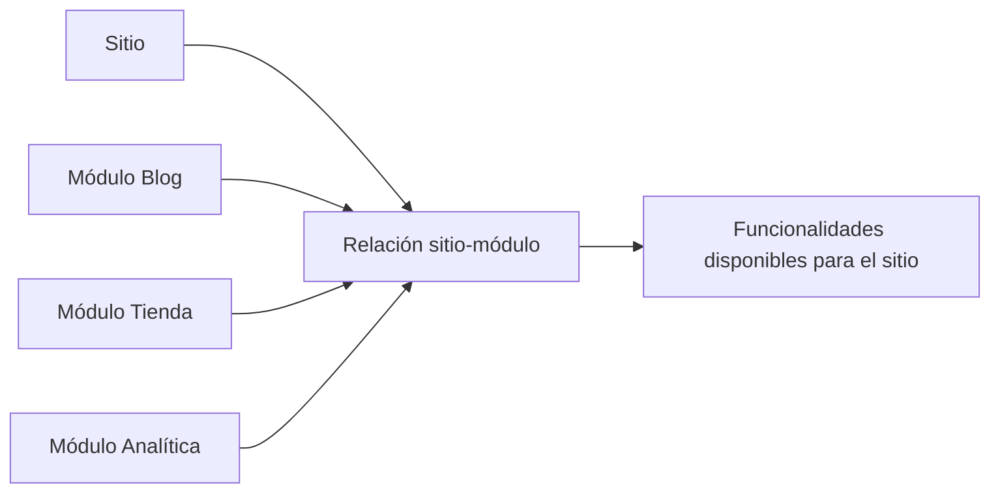

# API de sitios, plantillas y módulos

Estos endpoints forman el núcleo administrativo de All-InOne. Permiten gestionar la estructura base de la plataforma: sitios/tenants, plantillas reutilizables y módulos activables.

## Sitios

Un sitio representa una instancia de negocio dentro de la plataforma. Desde el backend se permite crear, listar, consultar, actualizar, eliminar lógicamente y asociar recursos visuales.

| Operación | Uso |
|---|---|
| Crear sitio | Registrar nuevo tenant o sitio empresarial. |
| Listar sitios | Consultar sitios disponibles. |
| Mis sitios | Consultar sitios asociados al usuario. |
| Obtener por ID | Revisar configuración específica. |
| Actualizar | Modificar datos del sitio. |
| Eliminar | Aplicar baja lógica o controlada. |
| Miniatura | Subir imagen representativa. |

## Plantillas

Las plantillas permiten reutilizar diseños. Son importantes para el constructor visual porque ofrecen una base clonable para nuevos sitios.

| Tipo | Descripción |
|---|---|
| Públicas | Disponibles para ser utilizadas por usuarios autorizados. |
| Privadas / propias | Asociadas a un usuario o contexto específico. |
| Con configuración JSON | Guardan estructura visual o datos del diseño. |
| Con miniatura | Incluyen recurso visual para selección. |

## Módulos

El catálogo de módulos define qué funcionalidades puede activar un sitio. Cada módulo tiene nombre, slug, descripción, tipo, configuración base y estado activo.

| Campo conceptual | Función |
|---|---|
| Nombre | Identificación visible del módulo. |
| Slug | Identificador técnico. |
| Tipo | Clasificación funcional. |
| Configuración base | Valores iniciales o parámetros del módulo. |
| Activo | Estado disponible o no disponible. |

## Relación sitio-módulo

La relación entre sitios y módulos permite habilitar o deshabilitar funcionalidades por tenant.

## Relevancia para auditoría

Este grupo de endpoints permite validar el corazón del modelo SaaS. La auditoría debe revisar si:

- los sitios funcionan como unidad multitenant;
- las plantillas se gestionan como recursos reutilizables;
- los módulos se activan de manera controlada;
- las acciones críticas requieren permisos;
- los endpoints se corresponden con las historias de usuario y pruebas.

**Frase para exposición:** “Sitios, plantillas y módulos son la base que permite que All-InOne funcione como plataforma SaaS modular y no como una aplicación única.”

