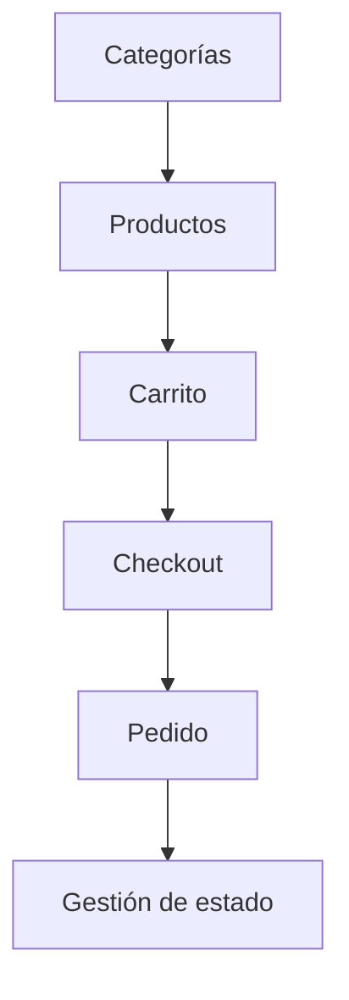

# API del módulo Tienda

El módulo Tienda permite que un sitio administre productos, categorías, carrito, pedidos y checkout. Es uno de los módulos de negocio más completos del backend porque combina gestión administrativa y flujo público de compra.

## Recursos principales

| Recurso | Descripción |
|---|---|
| Categorías | Organización del catálogo de productos. |
| Productos | Información comercial, precio, stock, imágenes y estado. |
| Carrito | Selección temporal de productos por usuario. |
| Pedidos | Resultado del checkout y control de estado. |
| Imágenes | Carga de recursos visuales para productos. |

## Rutas conceptuales

| Grupo | Ejemplos de rutas |
|---|---|
| Productos públicos | `GET /productos`, `GET /productos/{producto_id}` |
| Productos admin | `GET /admin/productos`, `POST /productos`, `PUT /productos/{id}`, `DELETE /productos/{id}` |
| Categorías | `GET /categorias`, `POST /categorias`, `PUT /categorias/{id}` |
| Pedidos | `GET /pedidos`, `GET /pedidos/{id}`, `PUT /pedidos/{id}/estado` |
| Carrito | `GET /carrito`, `POST /carrito/items`, `PUT /carrito/items/{id}` |
| Checkout | `POST /checkout` |
| Imágenes | `POST /upload-image` |

El prefijo general del módulo es:

```text
/api/v1/sitios/{sitio_id}/tienda
```

## Flujo funcional



## Separación pública y administrativa

| Tipo de operación | Requiere |
|---|---|
| Consulta pública de productos | Sitio existente y productos activos. |
| Gestión de productos | Permiso administrativo de tienda. |
| Gestión de categorías | Permiso administrativo de tienda. |
| Consulta/modificación de pedidos | Permisos de tienda. |
| Carrito y checkout | Contexto de usuario/sitio según flujo. |

## Controles relevantes

- verificación de existencia del sitio;
- filtrado por sitio para mantener aislamiento multitenant;
- productos activos/inactivos;
- permisos para operaciones administrativas;
- control de stock y datos comerciales;
- carga de imágenes en carpeta de uploads.

## Importancia para auditoría

La tienda permite revisar varios criterios de calidad: funcionalidad, seguridad, mantenibilidad, consistencia de datos y pruebas. También es un módulo útil para verificar si la arquitectura modular realmente soporta flujos de negocio complejos.

<div class="decision-box" markdown>
**Idea clave:** Tienda es un módulo de negocio completo porque no solo administra datos; conecta catálogo, carrito, checkout y pedidos dentro de un sitio específico.
</div>
