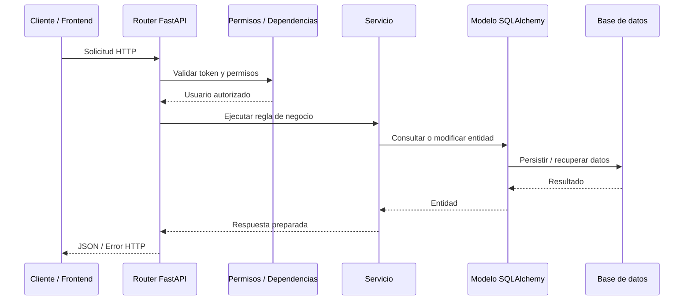

# Capas internas del backend

El backend organiza sus responsabilidades en capas. Esta separación evita que los endpoints concentren toda la lógica y permite que cada parte del sistema tenga una función clara.

## Flujo de una solicitud

## Responsabilidades por capa

| Capa | Archivos típicos | Responsabilidad |
|---|---|---|
| Router | `app/api/*.py`, `routes.py` de módulos | Recibir solicitudes, declarar endpoints, aplicar dependencias y devolver respuestas. |
| Dependencias | `get_db`, `get_current_user`, `require_permission` | Inyectar base de datos, usuario actual y validación de permisos. |
| Servicio | `app/service/*.py`, `services.py` de módulos | Ejecutar reglas de negocio, consultas y validaciones funcionales. |
| Esquema | `schemas/*.py` | Definir contratos de entrada/salida y validaciones Pydantic. |
| Modelo | `models/*.py` | Representar tablas, relaciones y atributos persistentes. |
| Base de datos | `database.py`, `SessionLocal`, `Base` | Administrar conexión, sesión y creación de tablas. |

## Beneficios de la separación

La separación por capas mejora la mantenibilidad porque permite cambiar una parte sin afectar innecesariamente todo el sistema. Por ejemplo, si se modifica la validación de un producto, se puede trabajar en el servicio o esquema correspondiente; si se cambia la forma de exponer un endpoint, se ajusta el router; si se agrega un nuevo atributo persistente, se trabaja sobre el modelo.

Desde el punto de vista de pruebas, esta estructura permite validar servicios, endpoints y modelos con enfoques distintos. Por eso existen pruebas en carpetas como `test/api`, `test/service`, `test/models`, `test/db` y `test/schemas`.

## Consideración técnica

No todos los módulos tienen exactamente la misma profundidad de separación. Algunos componentes concentran más lógica en servicios y otros en rutas, lo cual es normal en proyectos académicos en evolución. Sin embargo, la estructura general sí permite reconocer un patrón de capas y dominios.

**Criterio técnico:** una arquitectura por capas no se mide solo por carpetas, sino por la separación real de responsabilidades entre entrada HTTP, reglas de negocio, validación y persistencia.

