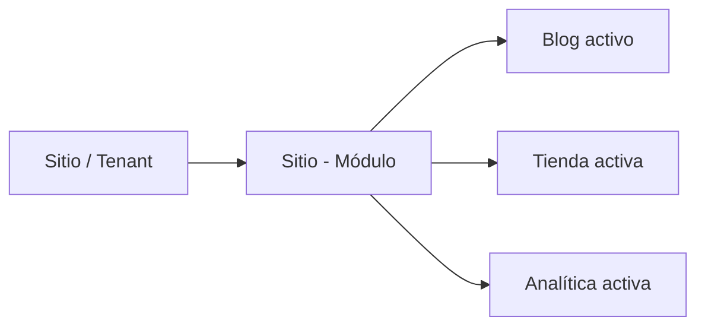

# Módulos del sistema

El backend organiza varias funcionalidades como módulos activables o dominios funcionales. Esto permite que la plataforma All-InOne no sea una sola aplicación rígida, sino una base común sobre la que cada sitio puede habilitar capacidades específicas.

## Módulos principales

| Módulo | Función principal | Tipo de uso |
|---|---|---|
| Sitios | Crear y administrar tenants/sitios. | Core administrativo. |
| Plantillas | Gestionar diseños reutilizables y clonables. | Core administrativo. |
| Módulos | Registrar funcionalidades activables. | Core de configuración. |
| Blog | Gestionar categorías, posts, estados y carga de imágenes. | Módulo de contenido. |
| Tienda | Gestionar categorías, productos, pedidos, carrito y checkout. | Módulo comercial. |
| Auth Público | Permitir registro/login de usuarios finales por sitio. | Módulo público. |
| Analítica | Registrar visitas, eventos y métricas. | Módulo de medición. |
| Roles y permisos | Controlar acciones disponibles por usuario. | Seguridad transversal. |

## Organización de módulos funcionales

Los módulos con lógica propia se ubican dentro de `app/packages/modulos`. Cada uno puede incluir modelos, esquemas, servicios y rutas. Esto ayuda a que Blog, Tienda y Analítica no dependan de un único archivo central.

```text
app/packages/modulos/
├── blog/
│   ├── models.py
│   ├── schemas.py
│   ├── services.py
│   └── routes.py
├── store/
│   ├── models.py
│   ├── schemas.py
│   ├── services.py
│   └── routes.py
├── analitica/
│   ├── models.py
│   ├── schemas.py
│   ├── services.py
│   └── routes.py
└── SiteAuth/
    ├── models/
    ├── schemas/
    └── services/
```

## Activación de módulos

El sistema cuenta con una relación entre sitios y módulos. Esta relación permite registrar qué funcionalidades están disponibles para cada sitio. En una plataforma SaaS, este punto es clave porque no todos los tenants necesariamente usan las mismas capacidades.

Ejemplo conceptual:



## Lectura desde auditoría

La auditoría SDLC debe diferenciar tres estados:

| Estado | Cómo se interpreta |
|---|---|
| Implementado | Existe evidencia en código, rutas, servicios, modelos y/o pruebas. |
| Parcial | Existe alguna estructura, pero no se evidencia flujo completo. |
| Planificado | Está documentado como evolución futura, pero no debe tratarse como terminado. |

Esta diferencia es muy importante para no sobrevalorar el alcance real del producto. Por ejemplo, un módulo puede aparecer en la planificación, pero la auditoría debe comprobar si realmente tiene endpoints, modelos, servicios y pruebas.

<div class="decision-box" markdown>
**Idea clave:** la modularidad del backend no significa microservicios; significa separación funcional dentro de una misma aplicación FastAPI.
</div>
