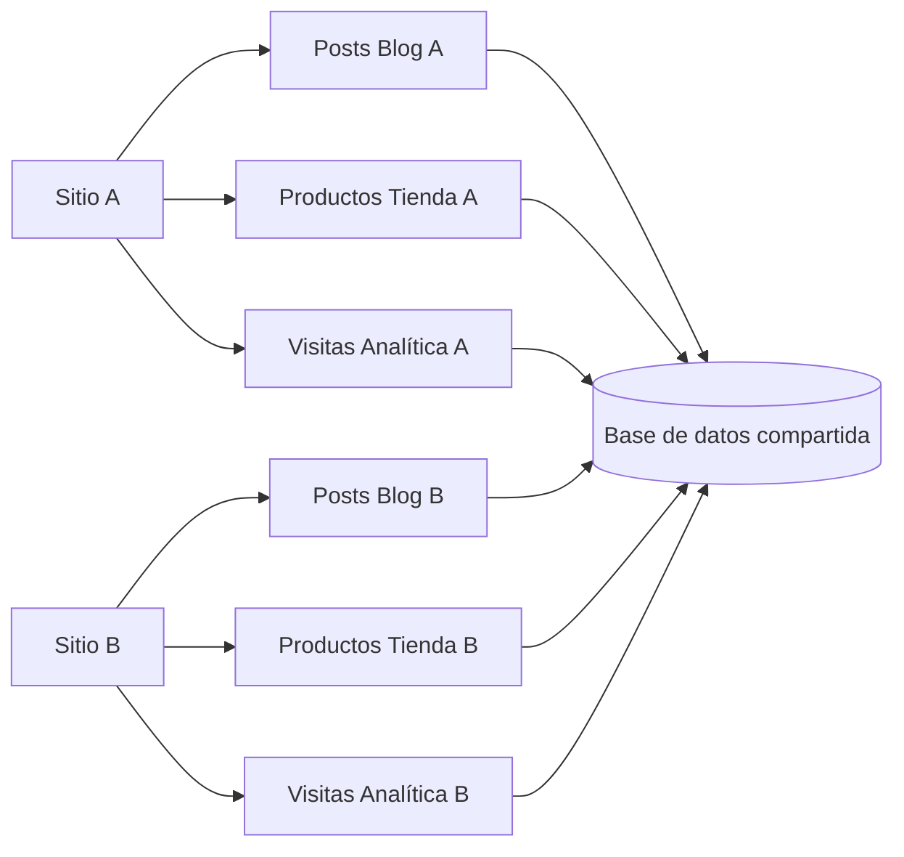

# Multitenancy y aislamiento por sitio

All-InOne se plantea como una plataforma SaaS multitenant. En este contexto, cada **sitio** funciona como una unidad de operación asociada a una empresa, negocio o tenant. El backend debe asegurar que los datos de un sitio no se mezclen indebidamente con los de otro.

## Enfoque usado

El aislamiento se maneja principalmente mediante relaciones con `site_id` o `sitio_id` en las entidades de los módulos. En lugar de crear una base de datos independiente por tenant, el sistema mantiene tablas compartidas y diferencia los registros por sitio.

## Ejemplos de entidades relacionadas con sitio

| Módulo | Entidad | Campo de aislamiento |
|---|---|---|
| Blog | Categorías y publicaciones | `site_id` |
| Tienda | Categorías, productos, pedidos y carrito | `site_id` / `sitio_id` |
| Analítica | Visitas, eventos y sesiones | `site_id` |
| Auth Público | Usuarios del sitio | Relación con sitio |
| Core | Sitios y módulos activados | Relación sitio-módulo |

## Por qué es importante

El multitenancy es uno de los riesgos técnicos más importantes del proyecto. Si un endpoint no filtra correctamente por sitio, podría mostrar información de otro tenant. Esto afectaría confidencialidad, integridad y confianza de la plataforma.

Por eso, la auditoría debe revisar que las consultas y operaciones administrativas consideren siempre el sitio correspondiente. También debe validar que los módulos activables no otorguen acceso a funcionalidades no habilitadas para un sitio.

## Controles asociados

- relación explícita entre registros y sitio;
- endpoints con parámetros `site_id` o `sitio_id`;
- verificación de existencia del sitio antes de operar;
- permisos administrativos para acciones sensibles;
- separación entre endpoints públicos y administrativos;
- pruebas funcionales y de API por módulo.

!!! warning "Riesgo técnico"
    El aislamiento multitenant debe comprobarse con evidencia. No basta con que exista el campo `site_id`; también debe verificarse que las consultas, servicios y endpoints lo apliquen correctamente.

**Frase para exposición:** “El backend usa un modelo multitenant basado en sitio; por eso la auditoría debe validar que cada operación respete el `site_id` correspondiente.”

