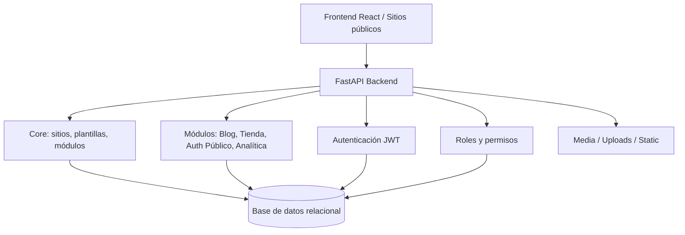

# Visión general de arquitectura

El backend de All-InOne adopta una arquitectura de **monolito modular**. Esto significa que el sistema se despliega como una sola aplicación backend, pero internamente se organiza por dominios funcionales y capas de responsabilidad.

Esta decisión permite mantener una estructura más simple que una arquitectura de microservicios, sin perder orden modular. Para un proyecto académico con múltiples módulos de negocio, este enfoque resulta adecuado porque facilita la comprensión, las pruebas, la documentación y el mantenimiento progresivo.

## Vista conceptual

## Componentes principales

| Componente | Responsabilidad |
|---|---|
| FastAPI | Exponer endpoints REST, agrupar routers, generar Swagger/OpenAPI y administrar dependencias. |
| SQLAlchemy | Modelar entidades, persistir información y trabajar con sesiones de base de datos. |
| JWT | Autenticar usuarios internos y proteger rutas del panel administrativo. |
| RBAC | Controlar acciones mediante roles y permisos. |
| Core del sistema | Gestionar sitios, plantillas, módulos, usuarios, roles y relaciones base. |
| Paquetes modulares | Encapsular Blog, Tienda, Auth Público y Analítica como dominios funcionales. |
| Auditoría y soft delete | Registrar operaciones relevantes y evitar eliminación física directa en entidades críticas. |

## Por qué monolito modular

El monolito modular permite que todos los módulos compartan infraestructura común: base de datos, autenticación, permisos, configuración, documentación Swagger y pipeline de pruebas. Al mismo tiempo, cada funcionalidad se mantiene separada en archivos y carpetas propias.

En este proyecto, la separación modular es importante porque All-InOne no administra una sola función. La plataforma combina constructor visual, gestión de sitios, activación de módulos y funcionalidades de negocio. Si todo estuviera mezclado en un único archivo o capa, el mantenimiento sería difícil y la auditoría SDLC tendría menos trazabilidad.

## Relación con el SDLC

Desde el punto de vista de auditoría, esta arquitectura aporta evidencia para evaluar:

- coherencia entre diseño documentado e implementación real;
- separación de responsabilidades;
- mantenibilidad del código;
- trazabilidad entre requisitos, módulos, rutas, modelos y pruebas;
- controles de seguridad y permisos por dominio;
- identificación de funcionalidades implementadas, parciales o planificadas.

**Decisión arquitectónica:** se prioriza un backend único y modular antes que microservicios, porque reduce complejidad operativa y mantiene separación lógica suficiente para el alcance académico del sistema.

