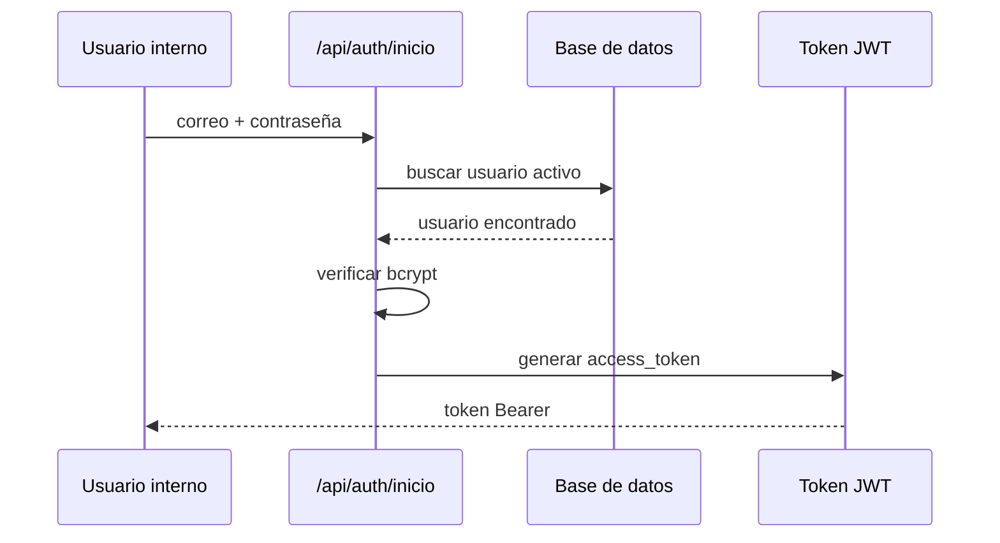
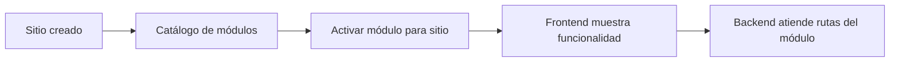
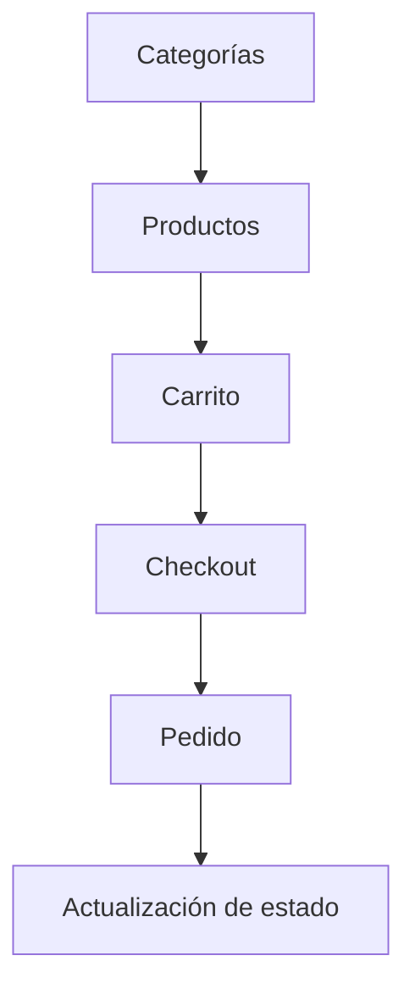

# Flujos principales del backend

Esta página resume los flujos más importantes que atiende el backend. No reemplaza la documentación de endpoints, pero ayuda a entender cómo se conectan los módulos y qué ocurre en una operación típica.

## 1. Inicio de sesión administrativo

Este flujo permite que un usuario interno acceda al panel administrativo. El backend valida credenciales, verifica que el usuario esté activo y genera un token JWT para solicitudes posteriores.

## 2. Gestión de sitios

Un sitio representa el tenant o unidad de negocio. Las operaciones de sitios permiten crear, listar, actualizar, eliminar lógicamente y cargar miniaturas.

| Paso | Descripción |
|---|---|
| Crear sitio | Se registra la información base del tenant. |
| Listar sitios | Se recuperan sitios disponibles según usuario/permisos. |
| Actualizar sitio | Se modifican datos de configuración. |
| Asociar módulos | Se activan funcionalidades como Blog, Tienda o Analítica. |
| Cargar miniatura | Se almacena recurso visual del sitio. |

## 3. Uso de módulos activables

Este flujo conecta el core del sistema con los módulos funcionales. El sitio puede activar funcionalidades y luego operar endpoints específicos de Blog, Tienda, Auth Público o Analítica.

## 4. Publicación de contenido Blog

El módulo Blog permite administrar categorías y publicaciones. Además, separa rutas públicas y administrativas, lo cual permite mostrar solo contenido disponible al visitante y conservar estados internos como borradores o archivados.

| Vista | Qué permite |
|---|---|
| Pública | Ver posts publicados disponibles. |
| Administrativa | Crear, editar, listar estados internos y eliminar lógicamente. |

## 5. Operación de Tienda

El módulo Tienda cubre un flujo comercial básico: categorías, productos, carrito, pedidos, estado de pedido y checkout.

## 6. Registro de analítica

Analítica permite registrar visitas y eventos de un sitio. Este módulo es útil para medir interacción y alimentar dashboards administrativos.

| Endpoint conceptual | Uso |
|---|---|
| Registrar visita | Guardar página, sesión, IP, user-agent y referencia. |
| Registrar evento | Guardar interacciones relevantes del visitante. |
| Dashboard | Consultar métricas agregadas por periodo. |

**Frase para exposición:** “Los flujos principales muestran que el backend integra gestión administrativa, módulos de negocio, usuarios públicos y métricas bajo una misma API modular.”

