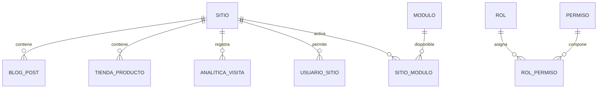

# Modelo de datos y entidades principales

El modelo de datos del backend se apoya en SQLAlchemy y representa las entidades principales de la plataforma. Estas entidades permiten administrar usuarios, sitios, plantillas, módulos, roles, permisos, contenido, productos, pedidos y métricas.

## Entidades del core

| Entidad | Tabla / dominio | Descripción |
|---|---|---|
| Usuario | Usuarios internos | Gestiona cuentas administrativas del sistema. |
| Rol | Roles | Define perfiles de acceso y responsabilidades. |
| Permiso | Permisos | Representa acciones autorizables por módulo. |
| Sitio | Sitios / tenants | Unidad principal de operación para cada empresa o tenant. |
| Plantilla | Plantillas | Diseños reutilizables para crear o clonar sitios. |
| Módulo | Módulos activables | Funcionalidades disponibles para ser asociadas a un sitio. |
| Auditoría | Log de auditoría | Registro de operaciones relevantes sobre entidades. |

## Entidades por módulo

| Módulo | Entidades representativas |
|---|---|
| Blog | Categoría, Post, estados de publicación, imagen destacada. |
| Tienda | Categoría, Producto, Pedido, ItemPedido, Carrito, ItemCarrito. |
| Auth Público | Usuario de sitio. |
| Analítica | Visita, Evento, Sesión. |

## Relación conceptual

## Diseño orientado a trazabilidad

El modelo incluye campos que permiten conservar historial y estado de los registros. En el core y módulos aparecen patrones como:

- identificadores primarios;
- relaciones mediante claves foráneas;
- campos de estado activo/inactivo;
- campos de fecha de creación o actualización;
- campos de eliminación lógica en entidades críticas;
- relación por sitio para sostener el multitenancy.

## Qué debe revisar un auditor

Desde la auditoría SDLC, el modelo de datos ayuda a validar si la arquitectura documentada realmente se refleja en la implementación. También permite comprobar si los módulos principales tienen soporte persistente y si los datos se separan por sitio.

| Criterio | Pregunta de revisión |
|---|---|
| Multitenancy | ¿Las entidades funcionales se relacionan con `site_id` o `sitio_id`? |
| Seguridad | ¿Los roles y permisos están modelados como entidades gestionables? |
| Trazabilidad | ¿Existe log de auditoría para acciones relevantes? |
| Conservación | ¿Se evita la eliminación física en registros sensibles? |
| Mantenibilidad | ¿Los módulos tienen entidades propias y no están mezclados sin criterio? |

**Idea clave:** el modelo de datos evidencia que All-InOne fue pensado como plataforma modular y multitenant, no como una aplicación plana de una sola empresa.

