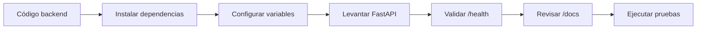

# Despliegue de prueba

El backend cuenta con elementos que permiten ejecutar y validar el sistema en entornos locales o de prueba. Esto incluye Dockerfile, Jenkinsfile, configuración de dependencias, Swagger y herramientas complementarias para pruebas.

## Componentes relacionados

| Componente | Uso |
|---|---|
| `Dockerfile` | Preparar imagen del backend. |
| `Jenkinsfile` | Automatizar validaciones técnicas. |
| `requirements.txt` | Definir dependencias Python. |
| `uvicorn` | Ejecutar aplicación FastAPI. |
| Swagger/OpenAPI | Probar endpoints desde navegador. |
| k6 / ZAP | Ejecutar pruebas no funcionales. |

## Flujo de despliegue de prueba

## Qué sí demuestra

- que el backend puede levantarse en entorno controlado;
- que los endpoints pueden consultarse en Swagger;
- que existe configuración para automatización;
- que se puede validar conexión de base de datos;
- que existen herramientas de prueba y calidad.

## Qué no demuestra

- implementación formal en una empresa real;
- pase controlado entre ambientes oficiales;
- aprobación formal de cambios productivos;
- monitoreo operativo continuo;
- garantía de disponibilidad en producción.

!!! warning "Interpretación correcta"
    Este despliegue de prueba es válido como evidencia técnica del proyecto, pero no debe marcarse como implementación productiva formal dentro del checklist SDLC.

**Idea clave:** el backend tiene capacidad de ejecución y validación técnica, pero la auditoría distingue claramente entre entorno de prueba y producción formal.

