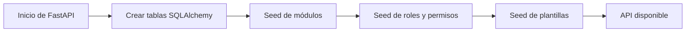

# Instalación local del backend

Esta guía describe cómo levantar el backend en un entorno local de desarrollo o prueba. Su finalidad es permitir que el equipo revise la API, ejecute pruebas, consulte Swagger y valide los flujos principales sin requerir un despliegue productivo formal.

!!! warning "Contexto académico"
    La instalación local sirve como evidencia técnica y ambiente de validación. No debe interpretarse como procedimiento formal de producción, ni como pase controlado entre ambientes empresariales.

## Requisitos previos

| Requisito | Uso dentro del backend |
|---|---|
| Python | Ejecución de FastAPI y dependencias del proyecto. |
| pip / entorno virtual | Instalación aislada de librerías. |
| Base de datos relacional | Persistencia de usuarios, sitios, módulos, plantillas y entidades de negocio. |
| Git | Control de versiones y trazabilidad del código. |
| Navegador | Consulta de Swagger/OpenAPI y endpoints públicos. |

## Flujo recomendado

```bash
# 1. Crear entorno virtual
python -m venv .venv

# 2. Activar entorno
# Windows
.venv\Scripts\activate

# Linux / macOS
source .venv/bin/activate

# 3. Instalar dependencias
pip install -r requirements.txt

# 4. Ejecutar servidor local
uvicorn app.main:app --reload
```

Una vez iniciado el servidor, FastAPI expone la API normalmente en el puerto configurado. Desde el navegador se puede revisar la documentación automática en:

```text
http://127.0.0.1:8000/docs
```

## Variables y configuración

La configuración del backend se centraliza en archivos de entorno y en el módulo de configuración. En el proyecto se utilizan parámetros asociados a conexión de base de datos, clave secreta JWT, algoritmo de firma, expiración de tokens y host de ejecución.

| Variable / Configuración | Finalidad |
|---|---|
| Base de datos | Definir conexión para SQLAlchemy. |
| SECRET_KEY | Firmar y validar tokens JWT. |
| ALGORITHM | Algoritmo usado para el token. |
| ACCESS_TOKEN_EXPIRE_MINUTES | Duración del token de acceso. |
| API_HOST | Host usado al ejecutar localmente con Uvicorn. |

## Inicialización de datos

Durante el arranque, el backend ejecuta tareas de inicialización relacionadas con creación de tablas y carga de datos base. Esto permite que el entorno local disponga de módulos, roles y plantillas iniciales para validar la funcionalidad principal.



## Verificación rápida

Después de levantar el proyecto, se recomienda validar:

- que `/health` responda estado de conexión a base de datos;
- que `/docs` muestre los endpoints agrupados por tags;
- que el login interno genere token JWT;
- que los endpoints protegidos requieran Bearer Token;
- que las rutas de módulos como Blog, Tienda y Analítica aparezcan en Swagger.

<div class="defense-box" markdown>
**Frase para exposición:** “El backend puede ejecutarse localmente para validar API, Swagger, base de datos y pruebas, pero esta instalación corresponde a un entorno académico/de prueba, no a una implementación formal en producción.”
</div>
