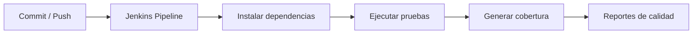

# Jenkins, cobertura y calidad

El backend incluye evidencias relacionadas con integración continua y calidad técnica. Jenkins permite automatizar pasos del proceso, mientras que las pruebas, cobertura y análisis estático ayudan a evaluar mantenibilidad, confiabilidad y riesgos del código.

## Rol de Jenkins

Jenkins funciona como herramienta de integración continua en el contexto académico/de prueba. Su objetivo es automatizar tareas como instalación de dependencias, ejecución de pruebas, validación de calidad y generación de reportes.

## Evidencias de calidad

| Evidencia | Uso |
|---|---|
| `Jenkinsfile` | Define pipeline técnico. |
| Pytest | Ejecuta pruebas automatizadas. |
| Coverage | Mide partes del código cubiertas por pruebas. |
| SonarCloud/SonarQube | Analiza calidad, duplicidad, bugs y mantenibilidad. |
| Snyk | Revisa dependencias y vulnerabilidades. |

## Interpretación correcta

La existencia de Jenkins y herramientas DevSecOps permite marcar evidencia de integración continua en un entorno académico. Sin embargo, no debe confundirse con un pipeline empresarial completo de despliegue productivo con aprobaciones formales.

## Preguntas que puede hacer el docente

| Pregunta | Respuesta corta |
|---|---|
| ¿Jenkins significa que hay producción? | No. Significa CI o validación técnica; producción formal es otra cosa. |
| ¿Coverage garantiza calidad total? | No. Ayuda a medir pruebas, pero debe interpretarse con escenarios reales. |
| ¿Sonar reemplaza code review? | No. Es análisis automático; el code review formal requiere flujo documentado de revisión. |

**Idea clave:** Jenkins y calidad sostienen evidencia DevSecOps, pero no convierten automáticamente el proyecto en despliegue productivo formal.

