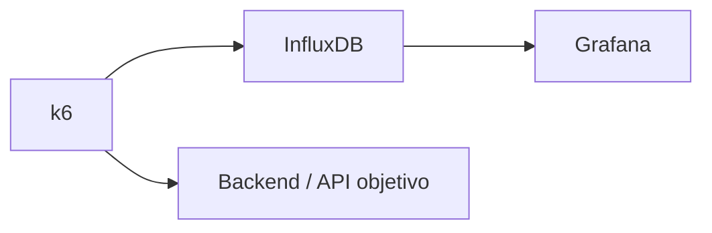

# k6: pruebas de rendimiento

k6 se utiliza para ejecutar pruebas de rendimiento sobre escenarios del backend o de la aplicación objetivo. Su finalidad es observar el comportamiento del sistema ante distintos niveles de carga y generar evidencia no funcional.

## Tipos de prueba disponibles

| Prueba | Propósito |
|---|---|
| Smoke | Verificar que el sistema responde con una carga mínima. |
| Load | Simular carga esperada o normal. |
| Stress | Incrementar carga para observar límites. |
| Spike | Aplicar picos bruscos de tráfico. |
| Soak | Mantener carga por más tiempo para revisar estabilidad. |

## Arquitectura de pruebas

El proyecto incluye soporte para k6, InfluxDB y Grafana. Esto permite ejecutar pruebas, almacenar métricas y visualizarlas en dashboard.

## Métricas relevantes

- tiempo de respuesta;
- tasa de errores;
- número de usuarios virtuales;
- solicitudes por segundo;
- percentiles p90, p95 o p99;
- estabilidad durante la prueba.

## Valor para auditoría

Las pruebas k6 apoyan la evaluación de eficiencia de desempeño y fiabilidad. También demuestran que el proyecto consideró aspectos no funcionales, no solo pruebas de funcionalidad básica.

!!! warning "Alcance"
    En contexto académico, k6 sirve como evidencia de pruebas de rendimiento, pero no reemplaza una certificación de capacidad productiva ni un dimensionamiento real de infraestructura.

**Idea clave:** k6 permite observar cómo responde el backend ante carga simulada y aporta evidencia para evaluar desempeño dentro del SDLC.

