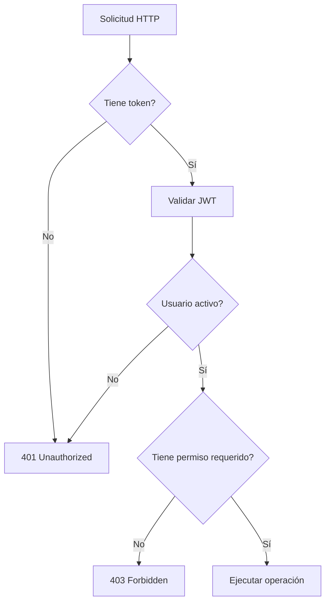

# Controles de seguridad del backend

La seguridad del backend se apoya en autenticación, autorización, separación de usuarios, permisos por rol, validaciones, auditoría y aislamiento por sitio. Estos controles son necesarios porque All-InOne administra múltiples tenants y módulos de negocio.

## Controles principales

| Control | Implementación conceptual | Riesgo que reduce |
|---|---|---|
| JWT | Token de acceso para usuarios internos. | Acceso no autenticado. |
| bcrypt | Hash de contraseñas. | Exposición de credenciales en texto plano. |
| RBAC | Roles y permisos por acción. | Usuarios con privilegios indebidos. |
| Dependencias FastAPI | Validación automática de usuario/permisos. | Omisión de controles en endpoints. |
| Multitenancy | Relación por `site_id` o `sitio_id`. | Acceso cruzado entre tenants. |
| Auditoría | Registro de operaciones críticas. | Falta de trazabilidad. |
| Soft delete | Conservación lógica de registros. | Pérdida irreversible de información. |

## Flujo de autorización

## Separación de acceso

El backend diferencia entre:

- usuarios internos administrativos;
- usuarios públicos de sitio;
- visitantes no autenticados;
- endpoints públicos;
- endpoints administrativos protegidos.

Esta separación es clave porque no todos los actores deben acceder al mismo nivel de información.

## Buenas prácticas observadas

- uso de tokens JWT;
- hash de contraseñas;
- permisos por código;
- dependencias reutilizables para autorización;
- separación entre rutas públicas y administrativas;
- exclusión de contraseñas en registros de auditoría;
- endpoints de salud y documentación para validación técnica.

**Frase para exposición:** “La seguridad del backend combina autenticación, permisos, aislamiento multitenant y trazabilidad, que son controles críticos para una plataforma SaaS.”

