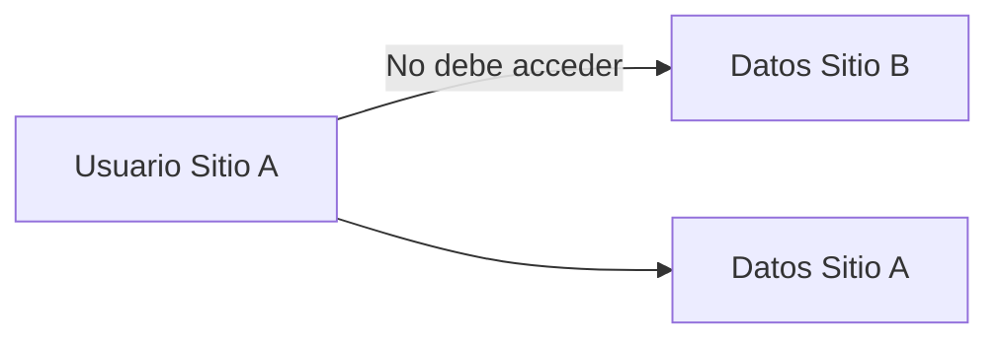

# Riesgos técnicos de seguridad

El backend tiene controles de seguridad importantes, pero por la naturaleza multitenant y modular de All-InOne existen riesgos que deben vigilarse continuamente.

## Riesgos principales

| Riesgo | Descripción | Control recomendado |
|---|---|---|
| Acceso cruzado entre tenants | Un usuario ve datos de otro sitio. | Filtrar siempre por `site_id` y validar pertenencia. |
| Endpoint sin permiso | Una ruta crítica permite modificar datos sin autorización adecuada. | Usar dependencias de permisos en operaciones sensibles. |
| Token mal manejado | Tokens vencidos, manipulados o de usuarios inactivos son aceptados. | Validar JWT, expiración y estado activo del usuario. |
| Exposición de datos sensibles | Respuestas o auditoría muestran contraseñas o secretos. | Excluir campos sensibles y revisar schemas. |
| Carga insegura de archivos | Archivos subidos sin control suficiente. | Validar tipo, tamaño, ruta y nombre. |
| Falta de trazabilidad | Acciones críticas no quedan registradas. | Aplicar auditoría en operaciones clave. |

## Riesgo multitenant

El riesgo más delicado es el acceso cruzado entre tenants. En una plataforma SaaS, cada sitio debe operar como unidad separada, aunque comparta backend y base de datos.

## Riesgo de permisos incompletos

Si una ruta administrativa no valida permisos, un usuario autenticado podría ejecutar acciones que no le corresponden. Por eso, la auditoría debe revisar endpoints de creación, actualización, eliminación y consulta administrativa.

## Riesgo documental

También existe riesgo cuando la documentación afirma que un control existe, pero el código no lo aplica en todos los flujos. Por eso la revisión debe contrastar documentación, endpoints, servicios y pruebas.

!!! warning "Criterio de auditoría"
    Un control de seguridad solo debe considerarse suficiente si existe evidencia técnica de su implementación y validación.

**Frase para exposición:** “El backend tiene controles de seguridad, pero la auditoría debe comprobar que se apliquen de forma consistente en cada módulo y endpoint crítico.”

